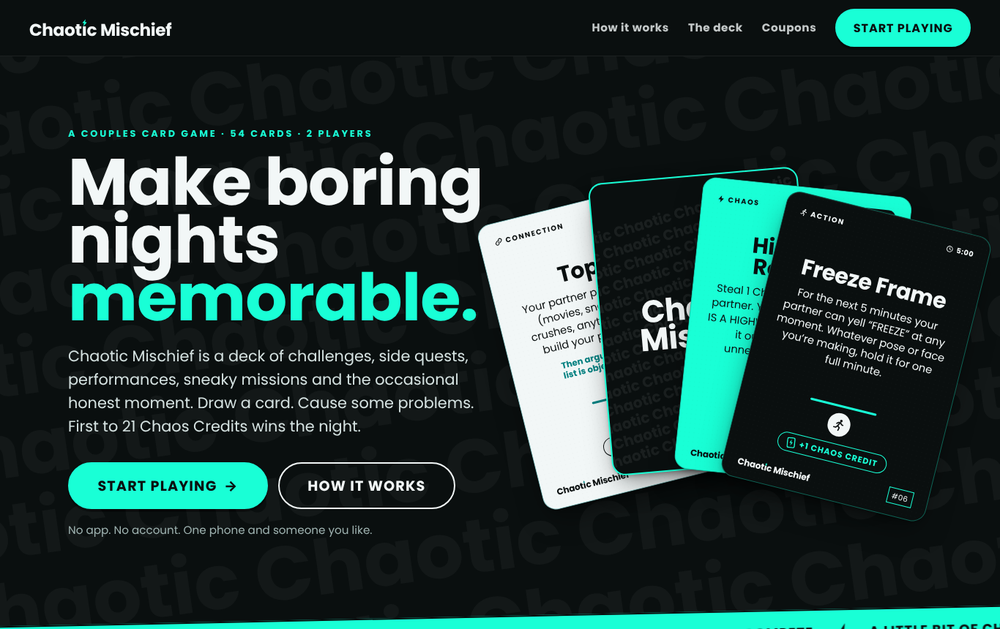
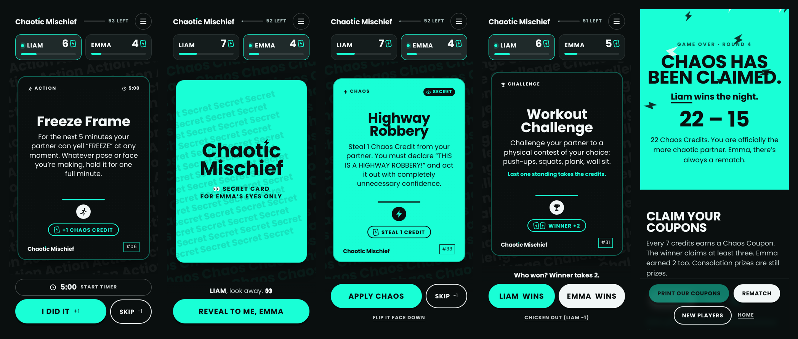
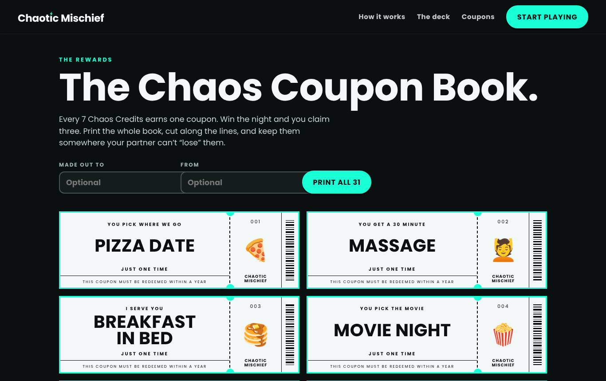

# Chaotic Mischief

**A couples card game for making boring nights memorable.**

Draw a card. Cause some problems. First to 21 Chaos Credits wins the night.

**▶ Play it: [nweinberg97.github.io/Chaotic-Mischief](https://nweinberg97.github.io/Chaotic-Mischief/)**



---

## What it is

Chaotic Mischief is a 54-card game for two people who are in a relationship and stuck in a rut. Its cards hand out challenges, side quests, performances, sneaky missions and the occasional honest moment.

It started life as a printable PDF deck. This repo is the interactive version: a playable web prototype that shows where the product goes when the deck becomes digital.

## The problem

Date night turns into a loop:

> "What do you want to watch?" / "I don't know." / "Want to order something?" / "Sure."

Most couples games try to fix this with deep questions. They're useful, but they ask a lot from people who are tired and on the couch. Chaotic Mischief bets on something else: **connection through shared experiences**. Laughing until it hurts, competing over stupid things, seeing your partner at their weirdest, and leaving with a story.

## The solution

A deck of seven card types, each with its own role in the night:

| Card | Stock | Role | Max credits |
| --- | --- | --- | --- |
| **Action** | Black | Do it now. No blinking. | 1 |
| **Performance** | Black | Entertain. Embarrass yourself proudly. | 1 |
| **Challenge** | Black | Compete or cry. Winner takes glory. | 2 |
| **Connection** | White | Honesty, nostalgia, and connection. | 1 |
| **Side Quest** 👀 | Teal | Do something small that means a lot. | 2 |
| **Mischief** 👀 | Teal | Harmless trouble. Maximum fun. | 2 |
| **Chaos** 👀 | Teal | Bend the rules. Make the night more fun. | 3 |

👀 = secret card: only the player who drew it gets to read it.

## The prototype



The flow is **Landing → Setup → Draw → Play the card → Score → Winner → Coupons**.

- **Landing page**: sells the idea, explains the rules and card types, and leads into the game.
- **Setup** ("Who's causing the problems tonight?"): two name tags and a coin flip for who goes first.
- **Game**: a deal-and-flip card animation, a quiet scoreboard with a `+2 CHAOS` microinteraction, and controls that change with each card's mechanic.
- **Winner screen**: "Chaos has been claimed." Each player picks the coupons they earned, then prints them.
- **Deck explorer** (`#/deck`): all 54 cards, filterable by type. Secret cards stay face down until you tap to peek.
- **Coupon book** (`#/coupons`): a preview of all 31 Chaos Coupons, with the print-ready book on sale.
- **Shop** (`#shop`): two instant downloads paid through Stripe, plus the boxed deck as a Kickstarter pre-order.

It is mobile-first, since most people will play on one phone passed back and forth, and it works on tablet and desktop too.

## Game mechanics

**Chaos Credits.** Complete a card to earn the credits shown on it. Every card displays its value: the joker-card Chaos Meter plus a label such as `+1 CHAOS CREDIT`, `WINNER +2` or `STEAL 1 CREDIT`. Skipping a card costs 1. Scores never drop below zero.

**First to 21 wins.** If one card pushes both players past 21, the higher score wins, and a tie goes to whoever played the card.

**Secret cards.** When a Chaos, Side Quest or Mischief card is drawn, it lands face down with a *"For Katie's eyes only"* back. The partner looks away and the drawer taps **Reveal to me**. The drawer can flip it back down after reading.

**Challenge cards.** Both players compete, then tap who won. The winner takes the credits, plus any doubling or Chaos Pile that's in play.

**Mischief cards.** Mark them *pulled it off* or *busted*. Some are counted, e.g. Feet Apart scores +1 per foot (max 2). You can also **keep a mission running in secret**: it goes into your hand, the scoreboard shows *"🃏 Up to something"*, and you cash it in later.

**Chaos cards** change the game itself:

| Card | Effect |
| --- | --- |
| Highway Robbery | Steal 1 credit (can't steal what isn't there) |
| Sabotage Pass | +1, and you can meddle with your partner's next visible card |
| Double Trouble | Next Challenge pays double; the loser owes a dare |
| Partner's Curse | +1, and your partner follows your rule for 5 minutes (live countdown) |
| Chaos Tax | Both pay 1 into the Chaos Pile; next Challenge winner takes it all |
| Imposter | You perform your partner's next card and keep the credits |
| Victory Lap | +3, conditional on an actual victory lap |
| Plot Twist | The trailing player takes 3 credits from the leader |

**Timed cards** (Accent Mode, Freeze Frame, Snack Run…) show a clock icon and offer a built-in timer that vibrates when time's up.

**Reward coupons.** Every 7 credits earns 1 Chaos Coupon. The winner claims at least 3. The loser gets whatever they earned.

**House rule:** if a card needs something you don't have, adapt it creatively or swap it for the next card. Chaos is flexible.

## Technical architecture

React 19 + TypeScript + Vite, with no other runtime dependencies.

```
src/
  types/game.ts        Domain model: Card, Category, Coupon, GameState, Outcome
  data/
    cards.ts           The 54-card deck as structured data + validation
    categories.ts      The 7 card types: tone, visibility, credit caps
    coupons.ts         The 31 reward coupons
  game/
    rules.ts           Pure rules engine: gameReducer(state, action) → state
    rules.test.ts      29 tests covering scoring, chaos effects, win state, saves
    storage.ts         localStorage save/load with validation and recovery
    useGame.ts         The one hook the UI uses: wraps the reducer with RNG, clock, persistence
  components/          CardFace/CardBack, FlipCard, Coupon, Scoreboard, CardActions,
                       ActivityTimer, Sheet (native <dialog>), Brand (wordmark, Chaos Meter)
  pages/               Landing, Setup, Game, Winner, Deck explorer, Coupon book
  styles/tokens.css    Every colour, font, radius and easing in one place
  utils/router.ts      A 30-line hash router (four routes didn't need a library)
```

**Content, rules and UI are separate layers:**

- **Cards are data.** Each card declares a `mechanic` (`standard | challenge | shared | mischief | chaos`), a `creditValue`, and optional `timerSeconds`, `maxCount`, `chaosEffect`, `specialRule`, `prompts`. Adding a card means editing `cards.ts` and nothing else. `validateDeck` checks for unique ids and category credit caps, and makes sure chaos cards have an effect. Invalid cards are dropped from play rather than crashing the game.
- **Rules are pure.** `gameReducer` takes randomness and time as action payloads (`order`, `now`), so it is deterministic and fully unit-tested. The UI never does arithmetic on scores.
- **The UI asks the rules.** `allowedOutcomes(card)` decides which buttons appear, and `creditLabel(card)` decides what the badge says.

**Persistence and edge cases.** Game state is saved to `localStorage` after every action, so a refresh resumes mid-card. Corrupt or outdated saves are rejected, and a save pointing at a deleted card falls back to the draw step. The deck never repeats a card until it runs out, and then offers a reshuffle that leaves out cards still in someone's hand. Name validation rejects empty and duplicate names.

**Design system.** Cards use CSS container query units (`cqi`), so the same component renders as a thumbnail, a landing-page fan or a full-screen card without separate layouts. `tokens.css` holds the brand palette (`#0a0f0f`, `#f2f7f7`, `#008080`, `#19ffd6`) and the type stack (League Spartan display, Jost standing in for Glacial Indifference). Both fonts are self-hosted from `src/assets/fonts` under the SIL Open Font License, so nothing loads from third-party servers.

**Accessibility.** Semantic landmarks, a skip link, real buttons everywhere, native `<dialog>` modals (focus trap and Esc built in), visible focus rings, an `aria-live` announcement of each move, progressbar semantics on scores, and `prefers-reduced-motion` support. Space/Enter draws a card.

## Product decisions

- **The game is the product, so the prototype is the game.** No auth, accounts, backend, payments or multiplayer. One phone, two people, local state. Each of those would have cost time that made the core loop no better.
- **Secret cards were the hardest thing to translate from paper.** A physical card hides itself; a shared screen doesn't. The solution is a face-down deal with a "for X's eyes only" back, an explicit reveal, and a way to flip it down again.
- **Mischief needed time.** On paper, "sneak a fake word into conversation" plays out over the evening. Instant scoring kills that, so mischief can run as a background mission. The partner sees *that* something is happening but not *what*.
- **Scoring should never need thinking.** Every card's value sits on the card, and the buttons under it are the only valid moves.
- **Brand over generic UI.** The card layout, wordmark, Chaos Meter, category icons, repeating-word backgrounds and ticket-style coupons all come from the original Canva templates. The digital game should feel like the same brand as the physical deck.

## Running locally

Requires Node 20+.

```bash
npm install
npm run dev        # http://localhost:5173
```

```bash
npm test           # rules engine test suite (Vitest)
npm run build      # type-check + production build to dist/
npm run preview    # serve the production build
```

The production build uses relative paths and hash routing, so `dist/` can be deployed to any static host, including GitHub Pages, without configuration.

## Selling it

The web game is free. Three things are for sale, all configured in `src/config.ts`:

| Product | Price | How it's sold |
| --- | --- | --- |
| The Chaos Coupon Book (31 coupons + 5 blanks, PDF) | $5 | Stripe Payment Link |
| The Full Deck + Coupon Book (54-card print-and-play PDF + coupons) | $12 | Stripe Payment Link |
| The Boxed Deck (physical) | Pre-order | Kickstarter, ships ~3 months after the campaign |

**To switch on a download product:**

1. Upload its PDF to Google Drive or Dropbox and copy a share link.
2. Create a Stripe Payment Link at the right price. Under *After payment*, choose *Don't show confirmation page* and redirect to:
   `https://nweinberg97.github.io/Chaotic-Mischief/#/thanks?item=coupons&dl=<URL-encoded share link>`
   (use `item=bundle` for the $12 product).
3. Paste the Payment Link into `checkoutUrl` for that product in `src/config.ts` and push.

The download link lives only in Stripe, never in this public repo. The thank-you page only shows links to known file hosts (see `safeDownloadUrl`), so it can't be used to dress up arbitrary URLs. Until a `checkoutUrl` is set, its button reads "Checkout opening soon".

**Kickstarter:** paste the campaign (or pre-launch) URL into `KICKSTARTER.url`, and set `live: true` once pledges open.

**Regenerating the PDFs** (e.g. after the final Canva art lands): run `npm run dev`, open `/print.html?doc=deck`, `?doc=coupons` or `?doc=bundle`, and print to PDF (Letter, margins none, background graphics on). The print pages are dev-only; Vite's production build ships only `index.html`.

## Roadmap

- **Final creative**: drop in the Canva card art, card backs and typography (tokens and components are built to be swapped)
- **Custom decks**: let couples write their own cards and inside jokes
- **Themed expansions**: travel night, double date, spicy edition
- **Saved games and couple profiles**: history, rivalries, lifetime Chaos Credits
- **Physical deck integration**: QR codes on printed cards that open the digital version
- **Date-night recommendations** based on the cards you liked
- **Social sharing**: "Our relationship status: 7 Chaos Credits ahead" share cards
- **Two-phone multiplayer**: each player holds their own secret cards
- **Physical product fulfilment**



---

*Powered by pure chaos. Good trouble only.*
